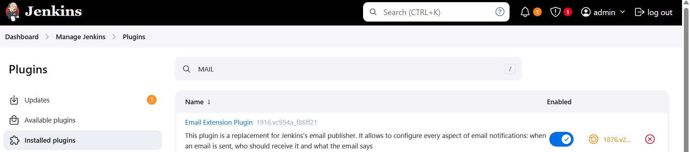
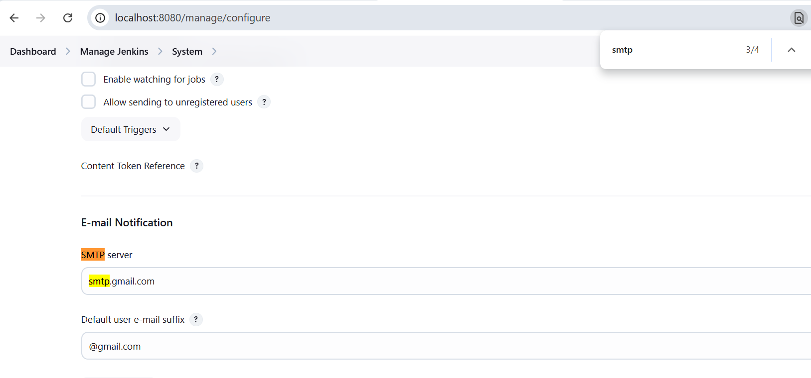
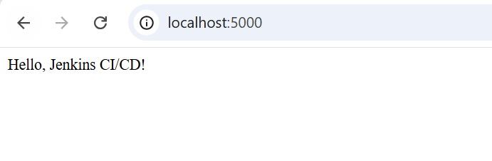

# Jenkins-Pipeline-Job-Flask
## Jenkins Pipeline for Flask App (Cross-Platform)

This pipeline builds, tests, and deploys a Flask application, compatible with both Unix and Windows agents.

---

### Jenkins Configurations to receive email's

Install Email Plugin


## Add SMTP Details



---

### Environment Variables

```groovy
environment {
    VENV_DIR = "env"                       // Name of virtual environment directory
    RECIPIENTS = "YOUR EMAIL HERE"   // Email for notifications
    FLASK_PORT = "5000"                    // Port to run Flask app
}
```

---

### Pipeline Stages

#### 1. **Build**

* Creates virtual environment.
* Installs Python dependencies from `requirements.txt`.
* Handles both Unix and Windows shells.

```groovy
stage('Build') {
    steps {
        script {
            if (fileExists('requirements.txt')) {
                if (isUnix()) {
                    sh "python3 -m venv $VENV_DIR"
                    sh "source $VENV_DIR/bin/activate && pip install -r requirements.txt"
                } else {
                    bat "python -m venv %VENV_DIR%"
                    bat "call %VENV_DIR%\\Scripts\\activate && pip install -r requirements.txt"
                }
            }
        }
    }
}
```

#### 2. **Test**

* Runs test cases using `pytest`.

```groovy
stage('Test') {
    steps {
        script {
            if (isUnix()) {
                sh "echo 'Testing the Flask App...'"
                sh "source $VENV_DIR/bin/activate && pytest test_app.py"
            } else {
                bat "echo Testing the Flask App..."
                bat "call %VENV_DIR%\\Scripts\\activate && pytest test_app.py"
            }
        }
    }
}
```

#### 3. **Deploy**

* Deploys the app for 1 minute.
* Starts Flask app in background.

```groovy
stage('Deploy') {
    steps {
        script {
            if (isUnix()) {
                sh "echo 'Deploying the Flask App on port $FLASK_PORT...'"
                sh "source $VENV_DIR/bin/activate && nohup python app.py > flask.log 2>&1 &"
            } else {
                bat "echo Deploying the Flask App on port %FLASK_PORT%..."
                bat "call %VENV_DIR%\\Scripts\\activate && start /B python app.py"
            }
            sleep time: 1, unit: 'MINUTES'
        }
    }
}
```

---

### Post-Build Notifications

Sends an email notification on success or failure.

```groovy
post {
    success {
        echo '✅ Build & Deploy succeeded!'
        script {
            mail to: "${RECIPIENTS}",
                 subject: "SUCCESS: ${env.JOB_NAME} #${env.BUILD_NUMBER}",
                 body: "✅ Build succeeded.\nSee: ${env.BUILD_URL}"
        }
    }
    failure {
        echo '❌ Build or Deploy failed.'
        script {
            mail to: "${RECIPIENTS}",
                 subject: "FAILURE: ${env.JOB_NAME} #${env.BUILD_NUMBER}",
                 body: "❌ Build failed.\nSee: ${env.BUILD_URL}"
        }
    }
}
```

### App runs in background for 1 min


---

### Notes

* Ensure `Mail` plugin is configured.
* Flask app should have `app.py` and `test_app.py`.
* Adjust ports and commands based on your deployment scenario.

---

### License

MIT License

